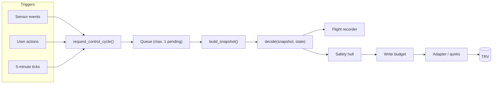
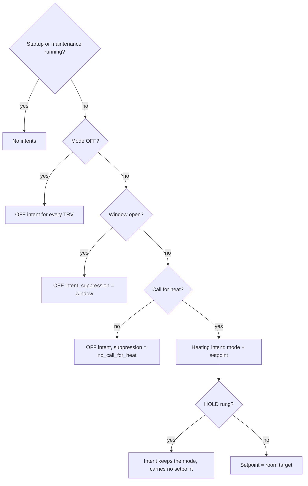

Better Thermostat separates a **pure decision core** from an
**imperative shell**. The core computes *what* every TRV should do; the
shell observes Home Assistant and performs the device writes. The
boundary is one function:

```text
decide(snapshot, state) -> (desired, state')
```

- A `WorldSnapshot` is the immutable observation of one control cycle:
  temperatures, modes, environment, and the reported state of every TRV.
- The `KernelState` aggregates the discrete state machines (the
  [regions](/internals/regions/)) that persist between cycles.
- A `DesiredState` expresses intent per TRV — mode, setpoint, valve
  percent, offset, and *why* heating is suppressed. Intent, not
  commands: the shell translates it into device writes.

`decide()` imports no Home Assistant code, performs no IO, reads no
clocks (time arrives inside the snapshot), and never mutates its input
state. The same inputs always produce the same decision — which is what
makes the [flight recorder](/internals/observability-and-testing/)
replayable.

## One control cycle



The snapshot is **pulled, not maintained**: it is built fresh at the
start of each cycle and discarded afterwards, so a decision always sees
one coherent world. Reactivity comes from the push side — every trigger
requests a cycle, and the queue holds at most one pending request. A
pending cycle automatically covers any state change that arrives before
it runs, so bursts of events coalesce into one decision instead of many.

A cycle runs on:

- **sensor events** — a relevant room-temperature change, a TRV state
  change, a window transition (after the configured debounce; window
  kicks replace a pending request),
- **user actions** on the entity — target temperature, preset, HVAC
  mode (the service path requests the cycle directly),
- **the five-minute ticks** — the calibration tick (controller modes)
  and the [reconciler](/internals/writes-and-reconciliation/),
- **the follow-up** a budget-deferred write schedules for itself.

Only one cycle runs at a time. The worst-case latency from event to
decision is the remainder of the cycle currently running — a few
seconds, dominated by device writes and their propagation wait.

## The decision cascade

`decide()` evaluates one precedence cascade; the first tier that fires
wins:



OFF intents carry their **suppression reason** so the shell can choose
between a literal OFF (window, no heat demand) and the device-specific
remap of the user's OFF mode — without reading the kernel's internals.
Unreachable TRVs receive no intent at all (their native thermostat
keeps controlling at the last commanded state), and one dead TRV never
drags the others down: intents are strictly per TRV.

## Where things live

| Concern | Home |
|---|---|
| Decisions (gates, precedence, modes) | `core/decide.py` + the regions |
| Observation | `utils/snapshot.py` → `core/snapshot.py` |
| Device writes | `utils/controlling.py` behind hull + budget |
| Cycle scheduling | `utils/scheduler.py` (requests coalesce) |
| Calibration math | `calibration.py` + `utils/calibration/` |
| Persistence | `utils/state_manager.py` |
| Diagnostics | `core/recorder.py` + `diagnostics.py` |

The placement rule for new code: a new rule about *what should happen*
belongs in the core, with pure unit tests. New *device interaction*
belongs in the shell behind the existing boundaries — writes go through
the safety hull and the write budget, cycles are requested through the
scheduler, and the shell applies intent without second-guessing the
kernel after `decide()` ran.
