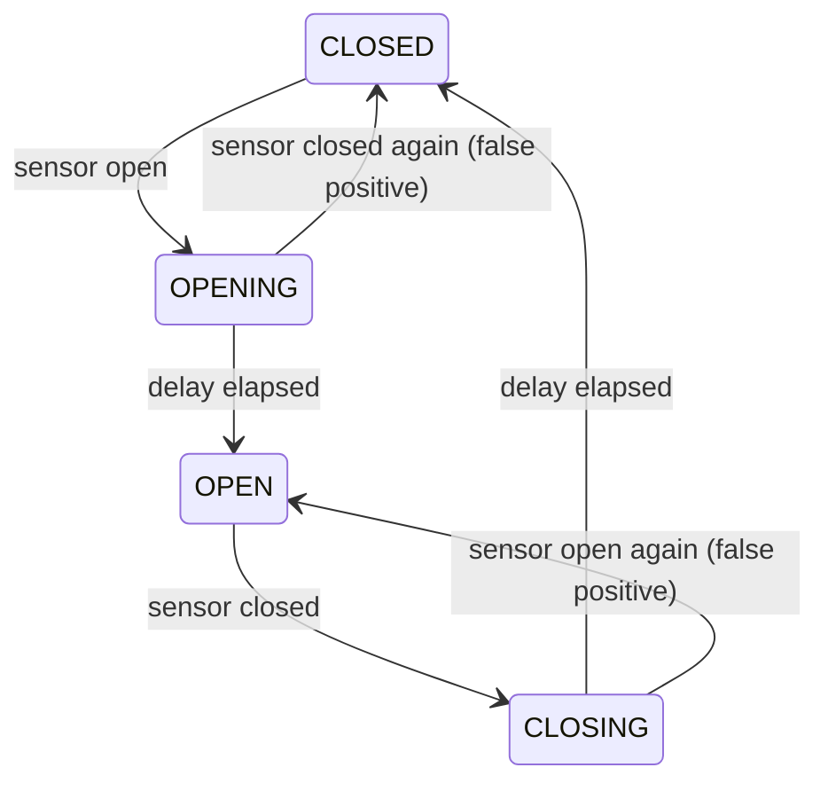
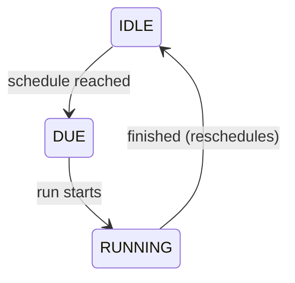

Discrete concerns — is a window open, is maintenance running, which
fail-soft rung rules — live in six small, orthogonal state machines
under `core/fsm/`, collectively the **regions** of the `KernelState`.
Two rules hold everywhere:

1. **Regions gate, controllers compute.** A region decides *whether*
   heating may happen; the continuous controllers (PID/MPC/TPI) decide
   *how much*. The two never mix.
2. **Regions never read each other's internals.** They compose through
   their inputs and through the decision cascade's precedence — data
   influence is allowed, state peeking is not.

All regions are plain frozen dataclasses with pure transition
functions; none of them is persisted across restarts. They re-derive
from live observations: lifecycle through the startup sequence,
window/maintenance/mode from the first events, the ladder and
reachability within one debounce window.

## Window — debounced open/closed

The *committed* phase rules the control law while a change is pending
(`effective_open` is true in OPEN and CLOSING). The region owns the
debounce timing: the queue handler sleeps exactly the remaining delay
the region asks for, re-reads the sensor, and re-steps until no
transition is pending — a delay reconfigured mid-flight changes the
next sleep, and a sensor that reverted cancels the transition. With a
delay of zero, the transition commits at the event itself.

## Maintenance — valve exercise with a liveness bound

The invariant that motivated the region: **a maintenance run must never
block control permanently.** `is_blocking()` stops honoring a RUNNING
phase once it exceeds the maximum runtime (one hour), and finishing a
run always returns to IDLE. An open window or OFF mode postpones the
schedule by an hour; without any maintenance-enabled TRV the next check
moves a week out.

## Lifecycle — startup, running, stopped

INITIALISING → STARTING (grace) → RUNNING → STOPPING. While startup
runs, `decide()` addresses no TRVs — the initial device sync happens
right after the startup-finished transition. The grace window also
defers the degraded-mode warning so slow cloud integrations get time to
come online before the user sees a repair issue.

## Mode — the user's HVAC mode

A validated mirror of the user's selected mode (off / heat / cool /
heat-cool), with the preset axis orthogonal to it. The mode tier of the
cascade reads it; setting the mode on the entity advances the region.

## Control mode — the fail-soft ladder

OPTIMAL → SENSOR_FALLBACK → HOLD. Downgrades commit after ~2 minutes of
sustained capability loss; upgrades only after ~5 minutes of sustained
recovery — hysteresis against flapping sensors. What each rung does is
described under [Safety and degradation](/internals/safety-and-degradation/).

## Reachability — per-TRV online/offline

Tracks per TRV when it went offline and how often a retry was
considered. Deliberately **diagnosis only**: in Home Assistant,
availability is push-based — writing to an unavailable entity does
nothing, and the device's return triggers state events that resume
control naturally. The region's value is the flight-recorder trail
(`offline_since`, `retry_count`) when analyzing an outage. The actual
effect is an address filter, not a cascade tier: unreachable TRVs are
dropped from the commanded set and receive no intent (except while boost
heating is active, which keeps commanding so the TRV catches up the
moment it returns).
