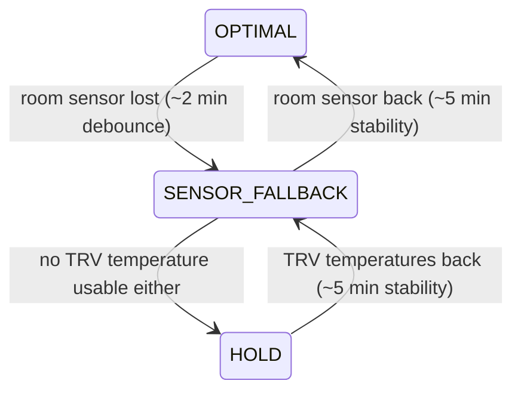

The guiding principle: **controlling worse is acceptable; not
controlling at all — or silently hanging — is not.** Degradation is
explicit, annunciated, and reversible.

## The safety hull

Every outgoing value passes `core/safety.py` at the command boundary:
setpoints are clamped to the device's min/max including the frost
floor, calibration offsets to the device's calibration range, valve
percentages to 0..`valve_max_opening`. The hull is the *second* guard —
the calibration math keeps its own intermediate clamps for bit-exact
debuggability — but it is the one that owns the boundary: no write path
may bypass it, including special cases like the boost safety reset.

Safety-relevant writes (OFF for an open window or absent heat demand,
frost-floor rewrites, closing the valve) also bypass the
[write budget](/internals/writes-and-reconciliation/): safety is never
throttled.

## The fail-soft ladder

- **OPTIMAL** — the external room sensor delivers; the control law
  works as configured.
- **SENSOR_FALLBACK** — the room sensor is unavailable, but at least
  one *reachable* TRV reports an internal temperature: calibration
  substitutes the mean of the TRV-internal readings. Controlling on a
  hot-valve sensor is worse than on a room sensor, but strictly better
  than controlling on a silently stale reading. A stored reading only
  counts while its TRV is actually reachable, and going unavailable
  invalidates it — pre-outage values cannot masquerade as live.
- **HOLD** — neither the room sensor nor any TRV temperature is usable
  (for example during a Zigbee outage). The kernel keeps the mode but
  emits no setpoint: the controller stops adjusting, devices keep their
  last commanded state, and the frost floor stays enforced on every
  write. Nothing downstream of the HOLD decision may re-introduce an
  adjustment — boost included.

Downgrades are debounced (`down_debounce_s`, 120 s) so a flapping sensor
does not flip behavior; upgrades require sustained recovery
(`up_stability_s`, 300 s). The rung is
visible as the `control_mode` attribute, along with `degraded_for_s`
and `unavailable_sensors`; entering degraded mode raises a repair issue
that clears itself on recovery.

Per-TRV, the bulkhead is the cascade itself: a dead TRV receives no
intent and its native thermostat keeps controlling at the last
commanded state — effectively in passthrough mode — while the other TRVs stay
fully controlled.

## The watchdog

`core/watchdog.py` answers one question: did a control cycle complete
recently? The heartbeat is stamped on every *deliberate* outcome of a
cycle — including skipping an unavailable TRV or deferring a write to
the budget — while error paths that bail out leave it alone, so a
genuine silent hang (no cycle for 15 minutes) raises an error and
forces a cycle through the reconciler tick.

## Calibrator self-healing and health

Self-healing applies where the pathology is unambiguous; everything
else is annunciation only:

| Pathology | Reaction | Threshold anchor |
|---|---|---|
| Non-finite values in learned state | Discard state, relearn from live data | none needed (NaN/Inf) |
| Runaway auto-tuned gains (PID) | Reset gains to defaults | configured gain ranges |
| Wound-up integrator (PID) | Reset integrator | actuator-derived integrator limits |
| Oscillating output | **Annunciate only** | ≥4 reversals between ≥20-point swings in the last 10 outputs |

Oscillation deliberately triggers no automatic gain backoff: a detector
that backs gains off on a false positive thrashes the controller —
worse than the oscillation it reacts to — so backoff stays a manual
decision until the detector is validated against the calibration
benchmark. Every verdict lands per TRV in the `calibrator_health`
attribute; a healthy verdict clears only the grades its reporter owns,
so the sanitize path and the oscillation watcher cannot flap each
other's annunciations.

Persisted state is hardened at three layers: deserialization skips
wrong-typed and non-finite fields per field, an unreadable store yields
defaults instead of killing startup, and the sanitize step heals
whatever still reaches a controller.
