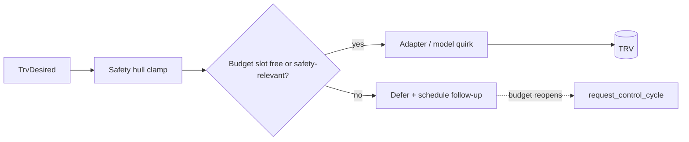

TRVs are battery- and radio-constrained devices, and writes get lost on
the air. Two mechanisms address this pair of facts: the **write
budget** spaces writes out, the **reconciler** heals the ones that got
lost. Deciding is never throttled — only the radio traffic is.

## The write path

A cycle writes only differences: a device already matching the intent
gets no write. For each TRV the shell translates the intent per
channel — HVAC mode, setpoint, calibration offset, valve percentage —
through the safety hull, the write budget, and finally the device
adapter:

**Adapters** (`adapters/`) speak the integration's dialect — Zigbee2MQTT,
deCONZ, Tado, generic climate services. **Model quirks**
(`model_fixes/`) override single operations for devices that need
special sequences (for example valve writes on the Sonoff TRVZB). The
`Trv` object carries both, plus a `TrvCapabilities` descriptor derived
in one place — whether the device supports offset writes or direct
valve writes — so the rest of the code consults capabilities instead of
probing quirk modules.

## The write budget

Non-safety writes to one TRV keep a minimum spacing of 30 seconds,
**per channel** (setpoint, offset, valve), so one channel's writes
cannot starve another's slot. Safety-relevant writes — OFF for an open
window or absent heat demand, frost-floor rewrites, closing the
valve — always bypass the budget but still stamp the slot, so the
spacing stays accurate.

A deferred setpoint write is not dropped: the defer path schedules one
coalesced control cycle for the moment the budget reopens. Deferred
offset writes re-derive on the next calibration tick.

## The reconciler

Every five minutes, `reconcile_tick` runs the same observe-decide step
as a control cycle (without a flight-recorder entry) and compares the
intent against what the devices report:

- **mode** — an OFF intent against a device reporting a heating mode
  (devices that cannot switch off legitimately stay in a heating mode
  at their minimum temperature and are compared by setpoint instead),
- **setpoint** — the last commanded value against the reported target,
  with a tolerance of half the device-reported step: firmware snapping
  a value onto its own coarser grid is convergence, not divergence,
- **offset** — the commanded calibration against the calibration
  entity, once the device confirmed the last write (in-flight writes
  remain the write path's business),
- **valve** — the commanded percentage against the adapter-written
  number entity, with a 5-point tolerance for device-side modulation.

On divergence the reconciler queues one ordinary control cycle — the
general healing mechanism that replaces per-case keepalives. The
tolerances are deliberate: a reconciler that fights device quantization
or normal modulation would re-send the same value every five minutes
and drain batteries, which is exactly what the budget exists to
prevent.

The same tick hosts the watchdog check: if no control cycle completed
for 15 minutes, it logs an error and forces one.
